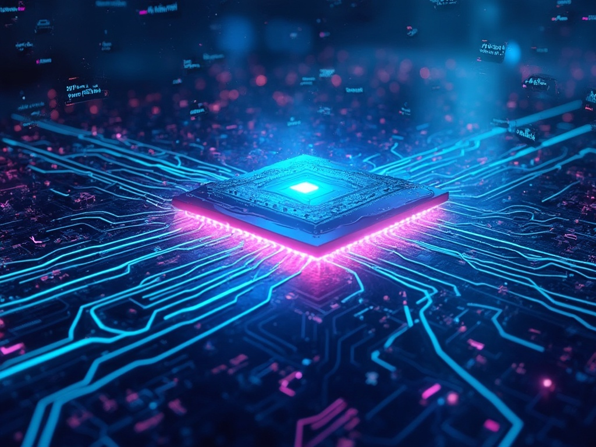

# GPU Programming Learning Journey

A collection of GPU kernels implemented one day at a time, progressing from basic to advanced concepts.

## Prerequisites
- NVIDIA GPU with CUDA support
- CUDA Toolkit installed
- Python 3.11+
- PyTorch

## Directory Structure
- [Day 1](./day01/) - Basic Vector Addition in CUDA
- [Day 2](./day02/) - Vector Addition with Python/PyTorch Bindings
- [Day 3](./day03/) - RGB to Grayscale Conversion
- [Day 4](./day04/) - RGB to Blurred Image Conversion
- [Day 5](./day05/) - Simple Matrix Multiplication
- [Day 6](./day06/) - Coalased Matrix Multiplication
- [Day 7](./day07/) - GELU Activation function
- [Day 8](./day08/) - NAIVE Batch Normalisation
- [Day 9](./day09/) - Sigmoid Activation function
- [Day 10](./day10/) - Tanh Activation function and Tiled Matrix Multiplication
- [Day 11](./day11/) - Dynamic Tiled Matrix Multiplication
- [Day 12](./day12/) - Layer Normalisation using Shared Memory
- [Day 13](./day13/) - Matrix Transpose
- [Day 14](./day14/) - Softmax using shared memory
- [Day 15](./day15/) - GELU Forward and Backward Kernels 
- [Day 16](./day16/) - Querying Gpu Properties 
- [Day 17](./day17/) - Custom NF4 Quantization Implementation
- [Day 18](./day18/) - Custom Double NF4 Quantization (QLORA STYLE) Implementation
- [Day 19](./day19/) - Transformers Self Attention Implementation
- [Day 20](./day20/) - Triton Basics
- [Day 21](./day21/) - Dropout in Triton
- [Day 22](./day22/) - Batch Norm in Triton
- [Day 23](./day23/) - [Not working] Chunked Cross Entropy Loss in Triton
- [Day 24](./day24/) - Device Propertiest using pytorch ( WILL USE LATER )
- [Day 25](./day25/) - Sigmoid in Triton
- [Day 26](./day26/) - Blur Kernel in Triton
- [Day 27](./day27/) - Gelu Kernel in Triton
- [Day 28](./day28/) - Tanh Kernel in Triton
- [Day 29](./day29/) - Transpose Kernel in Triton
- [Day 30](./day30/) - Layer Norm Kernel in Triton
- [Day 31](./day31/) - Tiled Matmul Corner Turning Kernel in Triton
- [Day 32](./day32/) - Partial Dequantise Kernel in Triton
- [Day 33](./day33/) - Animated Color Patterns in Cuda
- [Day 34](./day34/) - SiLU in Triton
- [Day 35](./day35/) - RMSNORM in Triton
- [Day 36](./day36/) - DyT in Cuda ( Transformers without normalisation )
- [Day 37](./day37/) - L2 NORM in cuda
- [Day 38](./day38/) - L1 NORM in cuda
- [Day 39](./day39/) - Thread Coarsening TILED MM in cuda
- [Day 40](./day40/) - USING NSIGHT COMPUTE to profile a candidate kernel and generate a report
- [Day 41](./day41/) - Swish Activation function in cuda
- [Day 42](./day42/) - Swapping elements in cuda
- [Day 43](./day43/) - Flash Attention in cuda
- [Day 44](./day44/) - GeGelu activation in cuda
- [Day 45](./day45/) - Tinkered with numba cuda
- [Day 46](./day46/) - Rope Embedding Kernel cuda
- [Day 47](./day47/) - SIMPLE BLAS Ops in CUBLAS cuda
- [Day 48](./day48/) - Matmul using mma(tensor cores) in cuda
- [Day 49](./day49/) - Rope Backward Pass in cuda
- [Day 50](./day50/) - SELF ATTENTION Backward Pass in cuda
- [Day 51](./day51/) - Lightning ATTENTION Forward Pass in cuda
- [Day 52](./day52/) - Optimising restnet18 using custom fused add relu cuda kernel
- [Day 53](./day53/) - Optimising kokoro using custom fused cuda kernels (Over next few days I will be optimising different ops in the model and all of the kernels would be applied here in the kokoro pipeline)
- [Day 54](./day54/) - Triplet Loss in cuda ( for constrastive training )
- [Day 55](./day55/) - MSE in cuda
- [Day 56](./day56/) - AdaIN with Snake Activation in cuda
- [Day 57](./day57/) - MISH activation in cuda
- [Day 58](./day58/) - Cosine Similarity in cuda
- [Day 59](./day59/) - Hinge Loss in cuda
- [Day 60](./day60/) - KL DIVERGENCE in cuda
- [Day 61](./day61/) - GEMM BIAS RELU in cuda
- [Day 62](./day62/) - Vector, Ldg, restrict and warp divergence optimised ELU kernel in cuda
- [Day 63](./day63/) - Parallel Block Reduction, Vector, Ldg, restrict and optimized mean and variance calculation Layer Normalization kernel in cuda with shared memory
- [Day 64](./day64/) - Relu Kernel optimised using 2d indexing and float4 vectorization
- [Day 65](./day65/) - Selu Kernel optimised using 2d indexing and float4 vectorization
- [Day 66](./day66/) - Sigmoid Kernel optimised using 2d indexing and float4 vectorization
- [Day 67](./day67/) - Tanh Kernel optimised using 2d indexing and float4 vectorization
- [Day 68](./day68/) - Transpose kernel using Cutlass Cute framework
- [Day 69](./day69/) - Huberloss float8 cuda
- [Day 70](./day70/) - Optimised Transpose kernel using Cutlass Cute framework
- [Day 71](./day71/) - Shared Memory Transpose kernel using Cutlass Cute framework
- [Day 72](./day72/) - Frobenius Norm in cuda
- [Day 73](./day73/) - MAX POOL in cuda
- [Day 74](./day74/) - AVG POOL in cuda
- [Day 75](./day75/) - Softplus in cuda using inline function
- [Day 76](./day76/) - Softplus Backward in cuda using inline function
- [Day 77](./day77/) - Hard Sigmoid in cuda
- [Day 78](./day78/) - Hard Sigmoid Backward in cuda
- [Day 79](./day79/) - Maxpool Backward in cuda
- [Day 80](./day80/) - Warp-Level intrinsics in CUDA
- [Day 81](./day81/) - Row Sum backward in CUDA
- [Day 82](./day82/) - Cosine Similarity using warp reduction in CUDA
- [Day 83](./day83/) - Jensen Shannon Distance in CUDA
- [Day 84](./day84/) - Batched Embedding Lookup in CUDA
- [Day 85](./day85/) - Lower Triangular Matrix in CUDA
- [Day 86](./day86/) - Gemm Kernel using Cutlass in CUDA
- [Day 87](./day87/) - Gemm Kernel using Shared Memory and Tiled Cutlass in CUDA
- [Day 88](./day88/) - TENSOR PARALLELISM IN CUDA
- [Day 89](./day89/) - Relu Fp16x8 IN CUDA
- [Day 90](./day90/) - HardShrink Fp16x8 IN CUDA
- [Day 91](./day91/) - AdamOptimizer implementation in Pytorch and CUDA
- [Day 92](./day92/) - Binary Neural Network IN CUDA
- [Day 93](./day93/) - Trying cp_async prefetch ptx instruction in cuda
- [Day 94](./day94/) - Understood use of cuda graphs and got speedup in pytorch
- [Day 95](./day95/) - Optimizing resnet50 using cuda graphs
- [Day 96](./day96/) - KV CACHE IN CUDA
- [Day 97](./day97/) - Trying Fused Swish MLP IN CUDA
- [Day 98](./day98/) - Trying Lora Kernel IN CUDA
- [Day 99](./day99/) - Trying GQA Kernel IN CUDA
- [Day 100](./day100/) - SPLITK GEMM Kernel IN CUDA

## FUTURE IDEAS

- <del>Flash Attention Implementation - A more memory-efficient attention mechanism</del>
- Flash attention Backward pass implementation
- Rotary Position Embedding (RoPE) - Key component in modern transformers
- Fused Multi-Head Attention - Combining operations for better performance
- KV Cache Implementation - Essential for inference optimization
- Grouped Query Attention (GQA) - Used in models like Llama 3
- PagedAttention - Memory-efficient attention algorithm from vLLM
- Quantization-Aware Training (QAT) - Training with simulated quantization
- <del>Weight Update with Adam Optimizer - Implement the optimizer directly in CUDA </del>
- FP8 or FP16 Training Loop - Explore lower precision training
- <del>Tensor Parallelism - Split computation across multiple GPUs</del>