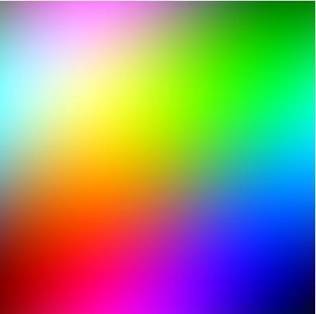

# Day 33: Animated Color Patterns

This implementation demonstrates generating an image with animated color patterns using CUDA.



## How It Works

The CUDA kernel calculates color values for each pixel based on sine waves that change over time, creating an animated effect. The red, green, and blue components are calculated independently and then combined to form the final pixel color.

## Prerequisites

- NVIDIA GPU with CUDA support
- CUDA Toolkit installed
- Python 3.6+ with pip
- PyTorch installed
- A C++ compiler compatible with your Python version

## Setup and Installation

1.  Create and activate a virtual environment:

    ```bash
    python -m venv myenv
    myenv\Scripts\activate  # On Windows
    source myenv/bin/activate  # On Unix/Linux
    ```
2.  Build and install the package:

    ```bash
    pip install .
    ```

## Usage

1.  Run the `test.py` script to generate and display the animated image.

    ```bash
    python test.py
    ```